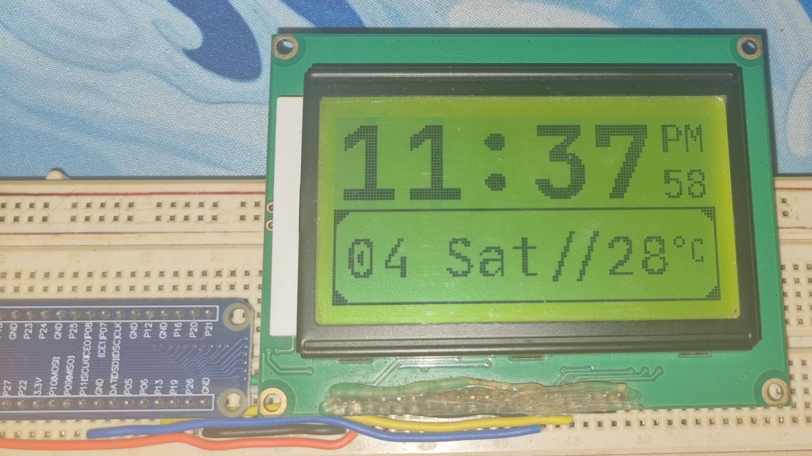

# ST7920 Raspberry Pi Dashboard

A Python-based project for driving an **ST7920 128x64 graphical LCD** over SPI with a Raspberry Pi.
It displays a live **digital clock, date, and current temperature** using data fetched from the **OpenWeatherMap API**.

The project provides:

* A driver for the ST7920 LCD (`driver.py`)
* A lightweight 1-bit graphics library with primitives (`graphics.py`)
* A dashboard application (`main.py`)

---

## Features

✅ ST7920 SPI driver with text and graphics support
✅ Bitmap-based graphics buffer with blending
✅ Shapes: lines, rectangles, circles, triangles (filled or outline)
✅ Render TrueType fonts (via PIL)
✅ Real-time clock with seconds, AM/PM indicator
✅ Weather integration via OpenWeatherMap

---

## Hardware

* **Raspberry Pi (any model with SPI and GPIO support)**
* **ST7920 128x64 LCD module** [datasheet](https://www.hpinfotech.ro/ST7920.pdf)
* Wiring:

  * SPI pins (MOSI, SCLK)
  * Chip Select pin → GPIO13 (configurable)
  * Reset pin → GPIO26 (configurable)

> CE/RS of LCD is connected to CS pin (not SPI CE pin) as LCD expcets active high, but raspberry pi's SPI CE pin is active low.

---

## Software Requirements

* Python 3.9+
* Libraries:

  * `spidev`
  * `gpiozero`
  * `numpy`
  * `pillow`
  * `requests`
  * `python-dotenv`

---

## Setup

1. **Enable SPI** on Raspberry Pi:

   ```bash
   sudo raspi-config
   ```

   Go to `Interface Options → SPI → Enable`.

2. **Clone this repository**:

   ```bash
   git clone https://github.com/AviShahCode/st7920-dashboard.git
   cd st7920-dashboard
   ```

3. **Fonts**
   Place your TTF fonts in a `fonts/` directory. The demo uses JetBrains Mono:

   * `JetBrainsMono-Bold.ttf`
   * `JetBrainsMono-Regular.ttf`

   You can replace them with any `.ttf` font installed on your system, although
   you might have to change the size and location of the widgets.

4. **Environment variables**
   Create a `.env` file in the project root:

   ```
   OPEN_WEATHER_MAP_API_KEY=your_api_key_here
   LAT=xx.xxxx
   LON=yy.yyyy
   ```

   You can get a free API key from [OpenWeatherMap](https://openweathermap.org/).

---

## Running

Run the dashboard:

```bash
python3 main.py
```

You should see:

* Time displayed at the top
* AM/PM and seconds at the right
* Date and temperature at the bottom

---

## File Overview

* `driver.py` → Low-level ST7920 driver (SPI communication, text & graphics mode)
* `graphics.py` → Bitmap-based drawing library (lines, circles, rectangles, text rendering)
* `main.py` → Example dashboard (clock + weather)

---

## Demo



---

## Future Improvements

* Icons for weather conditions (sunny, cloudy, rain, etc.)
* Animated transitions between updates
* Support for multiple pages/screens

---

## License

MIT License – feel free to use, modify, and share.

---
